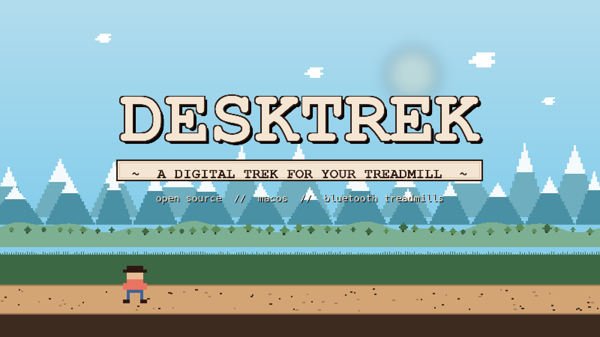

<p align="center">
  
</p>

# DeskTrek

**An open-source macOS walking game that drives your under-desk treadmill.**

> *You set out from your standing desk with a full pack, 211 trail miles ahead, and a treadmill that speaks Bluetooth. Morale is high. Energy is high. A marmot watches from the talus.*

DeskTrek pairs with your Bluetooth treadmill and turns every mile you walk into progress along a real-world trail — complete with an animated pixel-art hiker, wildlife drifting past in parallax, encounter choices that shift your morale and energy, and a printable certificate when you reach the summit. It lives in your menu bar, so it never steals your focus from the work you're actually supposed to be doing.

```
     \   |   /           .            .
       \ | /         .         .
    ---- O ----    .    ___.              .
       / | \         _/^   ^\_     .
     /   |   \    _/^         ^\_         .
                /^      /\       ^\
    ___________/________/__\_________^\__________
    .  .  .  . /\ .  .   .   . /\  .   .  .  .  .
       .     /  \    .     .  /  \     .      .
    .     .                              .    .
```

## Features

### Journey Mode — the headline feature

Pick a trail and start walking. Your treadmill miles accumulate along a real-world route, and the trail tells you a story as you go:

- **Animated pixel-art biome** — mountains, hills, and ground scroll in parallax; a 4-frame hiker walk cycle steps in time with your actual treadmill speed.
- **Landmarks** — named mile markers (Happy Isles, Half Dome, Cathedral Peak, Muir Pass, Mt. Whitney…) pass by with flavor text, a pixel sprite portrait, and an 8-bit chime when you reach them.
- **Trail signposts** — small wooden mile markers drift through the foreground so you can feel the miles ticking off even between named landmarks.
- **Encounters** — narrative choices appear at specific miles. A storm on the pass: push through or make camp? Each choice nudges your **morale** and **energy** bars and can award a badge.
- **Subquests** — multi-stage encounter chains that unlock a completion badge when you finish the arc (e.g. *Bear Canister Master*, *Sierra Storyteller*).
- **Ambient life** — clouds drift, eagles glide, marmots sit on talus, deer stand in the distance, the occasional bear moves through the treeline. Spawns are deterministic per-mile (seeded RNG), so the same stretch of trail always feels like the same stretch of trail.
- **Trophy wall** — every landmark you visit is collected as a pixel portrait. Every completed trail becomes a **printable PDF certificate** you can frame.
- **Pause and resume** — take a day off without losing progress. Re-baseline on your next walk.

### Oregon Trail retro aesthetic

```
 ___________________________________________
|                                           |
|   D E S K T R E K    ~  trail status  ~   |
|___________________________________________|
|  distance ..... 12.4 mi                   |
|  morale   ..... [####      ]              |
|  energy   ..... [######    ]              |
|  next    ...... Cathedral Peak (mi 33.1)  |
|___________________________________________|
```

Parchment palette. Monospaced fonts. Earth-tone UI panels and buttons that echo 90s edu-software. Context-aware trail messages across the app ("*You have mass-produced productivity. +2 morale.*"). 8-bit synthesized square-wave sound effects at workout start, workout end, goal achieved, and milestone reached — generated live at runtime in `Audio/SoundManager.swift`, so there are no WAV files to ship.

### Menu bar control center

Speed up, slow down, start, stop, and read live stats without leaving your workflow. One click in the menu bar, no app-switching.

### BLE treadmill control

Connects over Bluetooth Low Energy across four protocol families (see table below). Start, stop, pause, and adjust speed directly from your Mac.

### Goal tracking

Daily, weekly, monthly, or yearly goals for distance, time, or steps. Progress bars, streak tracking, goal-hit celebrations. Ambitions for the long haul.

### Auto-recording

Workouts start and stop themselves based on treadmill activity. No buttons — just walk.

### Smart notifications

Morning motivation, goal nudges, streak alerts, milestone celebrations. Rate-limited and configurable.

### Workout history & streaks

Full log of every session — distance, time, steps, calories. Consecutive-day streaks, because campfires need tending. Step counts are derived from distance and your stride length, so the numbers stay consistent even on treadmills that don't report steps natively.

## Shipping trail content

```
     /\
    /  \      JOHN MUIR TRAIL
   /    \     Yosemite Valley  ->  Mt. Whitney
  /      \    211 miles, 8 landmarks, 9 badges
 /________\
```

- **John Muir Trail** — 211 miles, Yosemite Valley to Mt. Whitney, 8 landmarks, 9 badges, narrative encounters + subquest arcs authored in [DeskTrek/Models/Journey/Content/JohnMuirTrail.swift](DeskTrek/Models/Journey/Content/JohnMuirTrail.swift).

Adding a new trail is a single Swift file plus one line in [DeskTrek/Models/Journey/TrailCatalog.swift](DeskTrek/Models/Journey/TrailCatalog.swift). Pixel art for landmarks, parallax layers, badges, and the finale scene is drawn programmatically in Swift in [DeskTrek/Views/Journey/Art/](DeskTrek/Views/Journey/Art/) — no sprite-sheet pipeline, no asset management.

## Supported treadmills

DeskTrek speaks four protocol families. If your treadmill shows up over Bluetooth, there's a good chance we've got a wagon hitched for it.

### DeerRun / PitPat
| Brand / Model | BLE Name | Status |
|---|---|---|
| DeerRun Urban Pro Plus | `PitPat-T01` | Confirmed |
| Other PitPat-compatible treadmills | `PitPat-*` | Community-tested |

### KingSmith / WalkingPad
| Brand / Model | BLE Name | Status |
|---|---|---|
| WalkingPad R1, R2 | `WalkingPad` | Confirmed |
| WalkingPad A1, C2 | `WalkingPad` | Confirmed |
| Other KingSmith models | `KS-*` | Community-tested |

### FTMS (Bluetooth Fitness Machine Service)
The industry standard. If your treadmill advertises the FTMS service UUID, DeskTrek will pick it up automatically.

| Brand | Status |
|---|---|
| LifeSpan | Confirmed |
| Horizon | Confirmed |
| NordicTrack | Community-tested |
| Any FTMS-compliant treadmill | Should work — let us know |

### FitShow / Budget Brands
A whole wagon train of affordable under-desk treadmills speak the FitShow protocol.

| Brand | BLE Name | Status |
|---|---|---|
| UREVO | `FS-*` | Confirmed |
| Goplus / SuperFit | `FS-*` | Community-tested |
| REDLIRO | `FS-*` | Community-tested |
| Costway | `SW*` | Community-tested |
| UMAY | `FS-*` | Community-tested |
| Sperax | `FS-*` | Community-tested |
| Egofit | `DB-*` | Community-tested |
| AIRHOT | `MERACH-*` | Community-tested |
| Other FitShow-compatible | `FS-*`, `SW*`, `MERACH-*`, `DB-*`, `XQIAO-*` | Contributions welcome |

Don't see your treadmill? Open an issue with the BLE name and we'll help you scout the trail.

## Requirements

- macOS 14.0 (Sonoma) or later
- Bluetooth Low Energy
- Xcode 15+ (to build from source)

## Building

```bash
git clone https://github.com/tehrenstrom/DeskTrek.git
cd DeskTrek
open DeskTrek.xcodeproj
```

1. Set your Development Team under **Signing & Capabilities**
2. Build and run (`⌘R`)

The app requests Bluetooth permissions on first launch.

## Architecture

DeskTrek uses an **adapter pattern** for treadmill support — each protocol family gets an adapter that conforms to `TreadmillAdapter`, and a registry matches discovered BLE devices to the right adapter. Journey Mode is a separate layer on top: a `JourneyEngine` consumes walked distance from `WorkoutRecorder`, advances trail state, triggers landmarks and encounters, and collects trophies.

```
DeskTrek/
├── Audio/
│   └── SoundManager.swift              # 8-bit synthesized SFX (AVAudioEngine)
├── BLE/
│   ├── TreadmillProtocol.swift         # TreadmillAdapter protocol
│   ├── TreadmillAdapterRegistry.swift  # BLE-device → adapter matcher
│   ├── TreadmillBLEManager.swift       # CoreBluetooth connection management
│   ├── PitPatProtocol.swift            # PitPat command encoding/decoding
│   └── Adapters/
│       ├── PitPatAdapter.swift         # DeerRun / PitPat
│       ├── KingSmithAdapter.swift      # KingSmith / WalkingPad
│       ├── FTMSAdapter.swift           # Bluetooth FTMS standard
│       └── FitShowAdapter.swift        # FitShow / budget brands
├── Models/
│   ├── AppSettings.swift               # User preferences
│   ├── AppState.swift                  # Global app state + adapter registration
│   ├── DataManager.swift               # Persistence coordinator
│   ├── Goal.swift, GoalManager.swift   # Goal definitions + tracking
│   ├── NotificationManager.swift       # Smart notification scheduling
│   ├── StatsCalculator.swift           # Workout statistics
│   ├── StepsEstimate.swift             # Distance → steps estimation (stride-length based)
│   ├── TrailMessages.swift             # Context-aware Oregon-Trail copy
│   ├── TreadmillState.swift            # Live treadmill state
│   ├── WalkSession.swift               # Active walk session model
│   ├── WorkoutRecord.swift             # Persisted workout
│   ├── WorkoutRecorder.swift           # Auto-recording logic
│   ├── WorkoutStore.swift              # Workout persistence
│   └── Journey/
│       ├── Trail.swift                 # Trail/Landmark/Encounter/Badge models
│       ├── TrailCatalog.swift          # Shipping trail registry
│       ├── JourneyEngine.swift         # Runs the current journey
│       ├── JourneyState.swift          # Serializable journey state
│       ├── JourneyStore.swift          # Journey + trophy persistence
│       ├── LegacyJourneyMigration.swift# Upgrade path from v1 journeys
│       ├── AmbientEncounters.swift     # Wildlife/weather spawning rules
│       ├── TrailSignposts.swift        # Wooden mile-marker spawn rules
│       ├── CertificateRenderer.swift   # PDF certificate renderer
│       └── Content/
│           └── JohnMuirTrail.swift     # JMT landmarks, encounters, badges
└── Views/
    ├── RetroTheme.swift                # Palette, fonts, panel/button styles
    ├── MenuBarView.swift               # Menu bar popover
    ├── DashboardView.swift             # Trail Status dashboard
    ├── GoalsView.swift                 # Ambitions
    ├── HistoryView.swift               # Journal
    ├── ConnectionView.swift            # Trailhead (BLE connection)
    ├── SettingsView.swift              # Camp
    ├── Root/
    │   ├── RootView.swift              # App root
    │   └── MainShell.swift             # NavigationSplitView sidebar shell
    ├── Shared/
    │   └── PixelImage.swift            # Sprite renderer (registry-backed)
    └── Journey/
        ├── TrailPickerView.swift       # Pick a trail, embark
        ├── JourneyMapView.swift        # Parallax map + hiker + encounters
        ├── JourneyWalkCard.swift       # Walk controls during journey
        ├── FreeWalkControlCard.swift   # Walk controls outside journey
        ├── EncounterBanner.swift       # Encounter choice UI
        ├── FinaleView.swift            # "YOU MADE IT!" + certificate
        ├── CertificateView.swift       # Certificate preview
        ├── TrophyWallView.swift        # Collected landmarks + certificates
        ├── BadgesView.swift            # Earned badge inventory
        ├── Art/
        │   ├── PixelCanvas.swift       # Procedural pixel-art primitives
        │   ├── PixelSprites.swift      # Sprite registry (hikers, landmarks, badges, finale)
        │   └── AmbientArt.swift        # Ambient creature/weather sprites
        └── Components/
            ├── HikerSprite.swift       # Walk-cycle renderer
            ├── LandmarkSprite.swift    # Landmark portrait renderer
            ├── ParallaxLayer.swift     # Tileable parallax band
            ├── AmbientEncounterLayer.swift  # Wildlife/weather overlay
            ├── TrailSignpostView.swift      # Single wooden mile-marker sprite
            └── TrailSignpostLayer.swift     # Signpost spawning + drift layer
```

**Tech stack:** Swift, SwiftUI, CoreBluetooth, SwiftUI Charts, AVAudioEngine (synthesized SFX).

## BLE protocols

The PitPat protocol was reverse-engineered with help from:

- [pitpat-treadmill-control](https://github.com/azmke/pitpat-treadmill-control) — Python implementation of the PitPat BLE protocol
- [pacekeeper](https://github.com/peteh/pacekeeper) — ESP32-based treadmill controller

The FTMS adapter implements the official [Bluetooth Fitness Machine Service](https://www.bluetooth.com/specifications/specs/fitness-machine-service-1-0/) specification. KingSmith and FitShow protocols were reverse-engineered from BLE traffic captures.

## Status

```
   *   .   *      Y O U   M A D E   I T !     *   .   *
  .  *    .   _____________________________  .    *  .
     .  *    |                             |   *  .
   *  .  .   |   ~~~  summit reached  ~~~  |  . *   .
  .   *      |_____________________________|      *
```

- Multi-brand BLE discovery and connection (PitPat, KingSmith, FTMS, FitShow)
- Treadmill start/stop/speed control
- Menu bar UI with live stats
- Goal system (daily/weekly/monthly/yearly)
- Journey Mode: trail picker, animated parallax map, hiker walk cycle, landmarks, encounters, subquests, badges, ambient wildlife/weather, PDF certificate
- Retro Oregon-Trail theme with synthesized 8-bit sound effects
- Auto-recording and workout history
- Smart notifications with streak tracking
- Speed calibration refinement (in progress)
- HealthKit sync (planned)
- Additional trail content beyond JMT (planned / contributions welcome)

## Contributing

The trail is better with company.

### Test with your treadmill
If you have any Bluetooth treadmill, try DeskTrek and report how it works. Even a "it showed up but didn't connect" is valuable intel.

### Add a new treadmill adapter
1. **Create your adapter** — add a new file in [DeskTrek/BLE/Adapters/](DeskTrek/BLE/Adapters/) (e.g. `YourBrandAdapter.swift`) that conforms to `TreadmillAdapter` in [DeskTrek/BLE/TreadmillProtocol.swift](DeskTrek/BLE/TreadmillProtocol.swift).
2. **Register it** — add your adapter to the registry in [DeskTrek/Models/AppState.swift](DeskTrek/Models/AppState.swift) so DeskTrek tries it during discovery.
3. **Add to the Xcode project** — if you create the file through the IDE, Xcode handles `project.pbxproj` for you.
4. **Submit a PR** — include any BLE traffic captures or protocol notes that'll help future travelers.

### Add a new trail
Trails are pure Swift data plus programmatic pixel art. Use [DeskTrek/Models/Journey/Content/JohnMuirTrail.swift](DeskTrek/Models/Journey/Content/JohnMuirTrail.swift) as the reference shape:

1. **Write the trail content file** — define landmarks, encounters, subquests, and badges. Add flavor text.
2. **Draw the art** — add parallax layers, landmark sprites, and a finale scene to [DeskTrek/Views/Journey/Art/PixelSprites.swift](DeskTrek/Views/Journey/Art/PixelSprites.swift) using the `PixelCanvas` DSL. Register them under the sprite keys referenced by your trail.
3. **Register the trail** — add it to `TrailCatalog.all` in [DeskTrek/Models/Journey/TrailCatalog.swift](DeskTrek/Models/Journey/TrailCatalog.swift).
4. **Submit a PR** — include a note on the route, any historical/cultural context you leaned on, and screenshots of the finale scene.

### Report bugs
Open an issue with steps to reproduce. Bonus points for BLE logs.

### Submit PRs
Fork the repo, create a feature branch, submit a pull request. Keep commits focused and descriptions clear.

## License

MIT License — see [LICENSE](LICENSE) for details.

## Author

Travis Ehrenstrom

---

*The trail is long. The desk is steady. Keep walking.*
